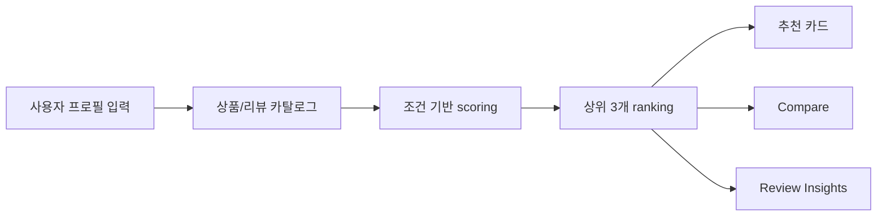
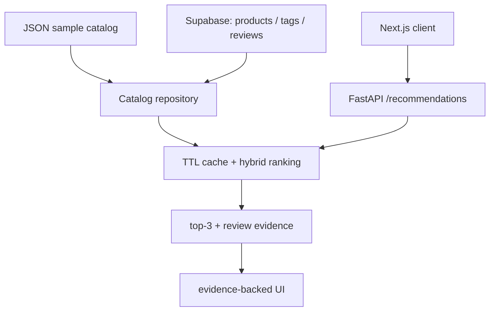

# GlowFit AI

[](https://github.com/Samuel-0930/glowfit-ai/actions/workflows/ci.yml)

**피부 프로필을 입력하면 제품 순위와 리뷰 근거를 함께 설명하는 뷰티 추천 시스템**

GlowFit AI는 화장품 리뷰와 상품 속성 데이터를 기반으로 사용자의 피부 타입, 고민, 선호 제형, 향 민감도, 예산, 회피 조건을 반영해 제품을 랭킹합니다. 단순히 정해진 결과를 보여주는 데모가 아니라, 입력 조건이 바뀌면 추천 후보·적합도·리뷰 근거·비교 결과가 함께 바뀌도록 구성했습니다.

현재 운영 데모는 Supabase에 적재한 **100개 페이스 스킨케어 제품과 1,074개 리뷰**를 사용합니다. 추천 점수만 제시하지 않고, 해당 결과가 나온 이유와 확인할 주의 신호를 제품 UI에서 바로 확인할 수 있게 설계했습니다.

[라이브 데모](https://glowfit-web.vercel.app) · [API Health](https://glowfit-api.vercel.app/health) · [Notion 포트폴리오 보기](https://app.notion.com/p/3996f7e3d828811fa0d7e358a783d6f6)

## 현재 데모에서 볼 수 있는 것

| 화면 | 역할 |
| --- | --- |
| 추천 | 사용자가 피부 조건을 직접 선택하고 상위 3개 제품을 추천받습니다. |
| 비교 | fit·근거 강도 원형 점수, 근거·주의 항목, 모델별 랭킹 신호를 비교합니다. |
| 리뷰 분석 | 추천에 사용된 리뷰 snippet과 aspect coverage를 확인합니다. |
| 구성 | 데이터·추천·운영 검증 흐름과 포트폴리오 문서를 한 곳에서 확인합니다. |

## 제품 흐름



## 핵심 구현

| 영역 | 구현 내용 |
| --- | --- |
| 입력 자유도 | 피부 타입, concerns, texture, fragrance sensitivity, budget, avoid 조건을 직접 선택 |
| 동적 랭킹 | FastAPI가 입력 profile과 상품 tag, 리뷰 evidence, 예산 조건을 조합해 score 계산 |
| 설명 가능성 | 추천 결과마다 reasons, cautions, evidence snippet, model signal을 함께 표시 |
| 비교 UX | fit score와 리뷰 근거 개수 기반의 근거 강도를 원형 score로 보여주고, model signal은 동적 bar로 비교 |
| 한국어 정보 구조 | 탐색, 입력, 안내 문구는 한국어로 제공하고 카탈로그 원문과 리뷰 근거는 보존 |
| 운영 검증 | GitHub Actions CI와 배포 후 smoke check로 공개 웹·API 흐름 확인 |

## 데모 화면

| 추천 변화 | 후보 비교 | 리뷰 분석 |
| --- | --- | --- |
|  |  |  |

## 왜 이 프로젝트가 포트폴리오로 강한가

- **추천 시스템 문제를 제품 흐름으로 연결했습니다.** 입력 profile, ranking score, 추천 결과, 리뷰 근거, 비교 화면이 하나의 사용자 여정으로 이어집니다.
- **정답 고정 데모를 피했습니다.** 조건을 바꾸면 추천 후보와 점수도 바뀌는 구조라 모델/랭킹 로직이 화면에서 드러납니다.
- **설명 가능한 추천을 구현했습니다.** 단순 점수 대신 review evidence와 aspect tag를 함께 보여줍니다.
- **데이터 파이프라인과 평가를 갖췄습니다.** 공개 데이터 preview, ASIN join, Supabase 적재, offline ranking evaluation을 별도 script와 문서로 관리하고, 표본·relevance 분포가 비교에 부적합하면 결과를 탐색용으로 표시합니다.
- **데모 운영 조건까지 구현했습니다.** 별도 Vercel 프로젝트의 Next.js/FastAPI 배포, 명시적 CORS·trusted host, TTL cache의 stale fallback, Firewall 기반 요청 제한을 적용했습니다.

## 모델/랭킹 구조

프론트엔드는 FastAPI의 `/recommendations`를 호출합니다. API는 기본 JSON 카탈로그 또는
Supabase 카탈로그를 선택해 로드하고, 원격 카탈로그는 짧은 TTL 캐시로 재사용합니다.
Supabase에 연결할 수 없으면 추천을 mock 결과로 대체하지 않고 `503` 오류를 반환합니다.



| Signal | 현재 구현 |
| --- | --- |
| popularity | 상품의 `review_count`를 정규화한 베이스라인 |
| rating | 상품의 `average_rating`을 정규화한 베이스라인 |
| review_average | 관측 리뷰 평점 평균 베이스라인 |
| content | 프로필-상품 tag 겹침에 예산 보너스와 회피 조건 패널티를 더한 점수 |
| hash_similarity | 해시 기반 텍스트 벡터 코사인 유사도 베이스라인 |
| fit score | content 0.40, hash_similarity 0.30, review_average 0.15, popularity 0.10, 리뷰 근거 보너스를 합친 최종 순위 점수 |

`fit score`와 `근거 강도`는 **현재 후보를 정렬하고 설명하기 위한 신호**입니다. 모델 정확도나 일반화 성능을 뜻하지 않으며, 개별 신호가 `1.0`인 경우에도 해당 입력에서 정규화된 랭킹 값일 뿐 성능 100%를 의미하지 않습니다.

## 실행 방법

Python 의존성 설치:

```bash
python3 -m pip install -e ".[dev]"
```

API 실행:

```bash
python3 -m uvicorn api.main:app --reload --port 8000
```

Supabase 카탈로그를 사용하려면 `.env.example`을 참고해 `GLOWFIT_CATALOG_SOURCE=supabase`,
`SUPABASE_URL`, `SUPABASE_SECRET_KEY`를 API 서버 환경에만 설정합니다. 연결 전 확인 방법과
로컬/호스팅 프로젝트별 설정은 [Supabase 문서](docs/supabase.md)를 참고하세요.

추천 API 호출:

```bash
curl -X POST http://localhost:8000/recommendations \
  -H "Content-Type: application/json" \
  -d '{
    "preferences": {
      "skin_type": "dry",
      "concerns": ["redness", "barrier care"],
      "texture": "light",
      "fragrance_sensitivity": "high",
      "budget_max_usd": 25,
      "avoid": ["strong scent", "sticky finish"]
    },
    "limit": 3
  }'
```

Frontend 실행:

```bash
npm --prefix frontend install
npm --prefix frontend run dev
```

브라우저에서 `http://localhost:3000`을 엽니다.

## 데이터와 평가 파이프라인

Amazon Beauty 스타일 JSONL을 GlowFit artifact로 변환:

```bash
python3 scripts/ingest_amazon_beauty_jsonl.py \
  --metadata sample_data/raw_amazon_metadata.jsonl \
  --reviews sample_data/raw_amazon_reviews.jsonl \
  --output-dir data/processed/amazon_beauty_sample
```

Hugging Face 공개 데이터 preview:

```bash
python3 scripts/fetch_huggingface_preview.py --length 25
```

Dataset Viewer가 일시적으로 503을 반환하면, Hub 원본 파일을 직접 사용해 ASIN 기준 카탈로그를 생성합니다. 메타데이터 Parquet만 캐시하고 리뷰 CSV는 필요한 행까지만 스트리밍합니다.

```bash
uv run --extra ingestion python scripts/fetch_huggingface_hub_catalog.py \
  --max-products 25 \
  --min-reviews-per-product 3 \
  --max-review-rows 100000
```

생성한 artifact를 Supabase용 seed SQL로 변환합니다. `--replace`는 기존 데모 카탈로그를 같은
트랜잭션 안에서 교체하므로, 운영 전환 시에만 명시적으로 사용합니다.

```bash
python3 scripts/generate_supabase_seed.py \
  --artifact-dir data/processed/hf_hub_catalog \
  --output data/processed/hf_hub_catalog/supabase_seed.sql \
  --replace
```

ASIN 기준으로 상품과 리뷰가 매칭된 public mini dataset 생성:

```bash
python3 scripts/fetch_huggingface_joined_preview.py \
  --target-matches 25 \
  --min-reviews-per-product 3 \
  --max-review-rows 250
```

processed public artifact 평가:

```bash
python3 scripts/evaluate_public_artifacts.py \
  --artifact-dir data/processed/hf_joined_preview \
  --output artifacts/public_evaluation.json
```

평가 결과의 `comparative_ready`가 `false`이면 해당 수치는 파이프라인 검증용입니다. 특히 커밋된
3개 제품 fixture는 모든 제품이 relevance 기준을 충족하므로 모델 성능 비교 근거로 사용하지 않습니다.
해석 기준은 [평가 문서](docs/evaluation.md#evaluation-integrity-gate)에 정리했습니다.

더 큰 artifact에서는 `temporal_user_holdout`도 함께 생성됩니다. 사용자별 마지막 긍정 상호작용을
보류하고 그 시점 이전 리뷰만으로 순위 신호를 계산하며, 적격 사용자가 20명 이상일 때만 비교용으로
표시합니다.

## 검증

```bash
python3 -m ruff check .
python3 -m pytest -q
npm --prefix frontend test
npm --prefix frontend run build
```

검증은 GitHub Actions에서 Python test suite, 프론트엔드 타입·테스트, 공개 운영 URL smoke check를 순서대로 실행합니다. 로컬 실행 방법은 위 명령을 따르고, 최종 상태는 CI와 Vercel 배포 상태를 기준으로 확인합니다.

## 배포

개인 포트폴리오 데모는 Vercel Hobby에서 프론트엔드와 FastAPI를 별도 프로젝트로 배포합니다.
API는 Vercel Python Runtime의 `api/index.py` 진입점을 사용하며, 요청 제한은 서버 메모리가 아닌
Vercel Firewall에서 적용합니다. 환경 변수와 Firewall 규칙은 [배포 체크리스트](docs/deployment.md)를
따릅니다.

`main` 배포 후에는 GitHub Actions가 [공개 프론트엔드](https://glowfit-web.vercel.app)와
[API](https://glowfit-api.vercel.app/health)를 실제 요청으로 확인하는 smoke check를 수행합니다.

## 문서

- Architecture: [docs/architecture.md](docs/architecture.md)
- Data ingestion: [docs/data-ingestion.md](docs/data-ingestion.md)
- Hugging Face preview: [docs/huggingface-preview.md](docs/huggingface-preview.md)
- Joined public preview: [docs/huggingface-joined-preview.md](docs/huggingface-joined-preview.md)
- Hub direct catalog fallback: [docs/huggingface-hub-catalog.md](docs/huggingface-hub-catalog.md)
- Evaluation: [docs/evaluation.md](docs/evaluation.md)
- Portfolio case study: [docs/portfolio-case-study.md](docs/portfolio-case-study.md)
- Supabase catalog: [docs/supabase.md](docs/supabase.md)
- Deployment checklist: [docs/deployment.md](docs/deployment.md)
- Security test plan: [docs/security-test-plan.md](docs/security-test-plan.md)
