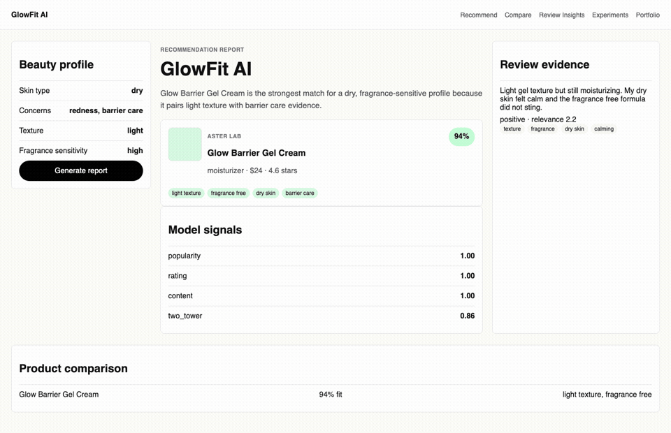
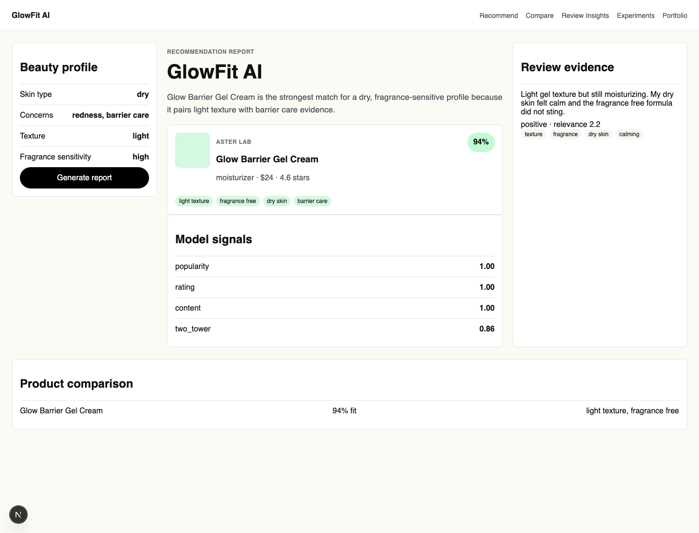
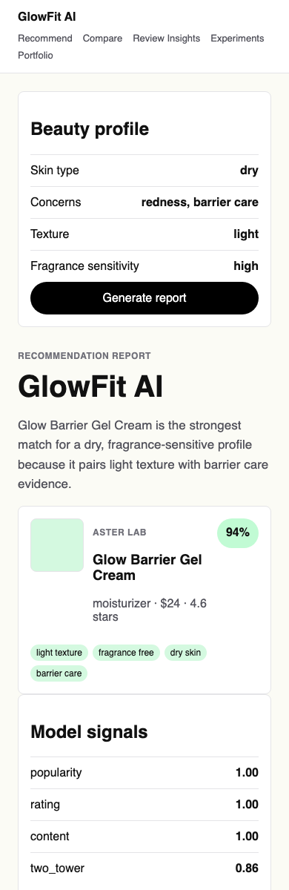
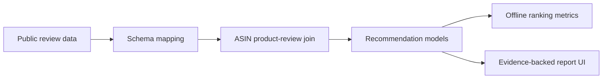

# GlowFit AI

[](https://github.com/Samuel-0930/glowfit-ai/actions/workflows/ci.yml)

**리뷰 근거를 보여주는 설명 가능한 뷰티 추천 리포트 시스템**

GlowFit AI는 화장품 리뷰 데이터에서 사용자 취향, 피부 고민, 향 민감도, 예산 조건을 반영해 제품을 추천하고, 왜 그 제품이 맞는지 리뷰 근거와 모델 점수로 설명하는 데이터 사이언스/ML 엔지니어링 포트폴리오 프로젝트입니다.



[Notion 포트폴리오 보기](https://app.notion.com/p/3746f7e3d82881919c76e7340a8a508a)

## 한눈에 보는 결과

| 영역 | 구현 내용 |
| --- | --- |
| 문제 정의 | 리뷰가 많은 뷰티 상품에서 사용자에게 맞는 제품과 근거를 빠르게 찾기 |
| 데이터 파이프라인 | Amazon Beauty 스타일 JSONL 파싱, Hugging Face 공개 데이터 preview, ASIN 기준 상품-리뷰 join |
| 추천 모델 | popularity, rating, collaborative, content-based, Two-Tower, hybrid ranker |
| 설명 가능성 | 추천 결과 옆에 리뷰 evidence snippet, model score, caution을 함께 표시 |
| 평가 | precision@k, recall@k, NDCG@k 기반 offline ranking evaluation |
| 제품화 | FastAPI + Next.js report workspace, 반응형 데모 화면 |

## 데모 화면

| Desktop | Mobile |
| --- | --- |
|  |  |

## 왜 이 프로젝트가 포트폴리오로 강한가

단순히 예쁜 추천 UI를 만든 것이 아니라, 채용자가 데이터 사이언스 프로젝트에서 보고 싶어 하는 흐름을 끝까지 연결했습니다.



- **데이터 엔지니어링**: 공개 데이터와 deterministic fixture를 분리하고, raw/processed artifact 경계를 명확히 관리했습니다.
- **추천 시스템 이해**: baseline부터 Two-Tower 스타일 retrieval까지 모델 tier를 나누고 비교할 수 있게 만들었습니다.
- **평가 가능성**: 추천 결과를 감으로 판단하지 않고 precision@k, recall@k, NDCG@k로 비교합니다.
- **설명 가능한 AI 제품 감각**: 모델 점수만 보여주지 않고, 실제 리뷰 근거를 함께 보여주는 report-first UX를 구현했습니다.

## 모델 스택

| Tier | Model | 목적 |
| --- | --- | --- |
| Baseline | Popularity | 리뷰 수가 많은 제품을 우선 추천하는 기준선 |
| Baseline | Average rating | 평점이 높은 제품을 우선 추천하는 기준선 |
| Core | Collaborative filtering path | 리뷰 평점 기반 사용자-상품 상호작용 신호 반영 |
| Core | Content-based scoring | 피부 타입, 텍스처, 고민, 회피 조건과 상품 속성 매칭 |
| Advanced | Two-Tower Retrieval | 사용자 선호 벡터와 상품 벡터의 compatibility scoring |
| Product layer | Hybrid ranker | 모델 점수와 evidence availability를 함께 반영 |

## 평가 결과 예시

기본 fixture 기준 sample evaluation 결과입니다.

| Metric | Value |
| --- | ---: |
| precision@1 | 1.0000 |
| recall@1 | 0.5000 |
| ndcg@1 | 1.0000 |
| precision@3 | 0.6667 |
| recall@3 | 1.0000 |
| ndcg@3 | 0.9197 |

## 실행 방법

Python 의존성 설치:

```bash
python -m pip install -e ".[dev]"
```

API 실행:

```bash
uvicorn api.main:app --reload --port 8000
```

Frontend 실행:

```bash
npm --prefix frontend install
npm --prefix frontend run dev
```

브라우저에서 `http://localhost:3000`을 엽니다.

## 데이터와 평가 파이프라인

Amazon Beauty 스타일 JSONL을 GlowFit artifact로 변환:

```bash
python scripts/ingest_amazon_beauty_jsonl.py \
  --metadata sample_data/raw_amazon_metadata.jsonl \
  --reviews sample_data/raw_amazon_reviews.jsonl \
  --output-dir data/processed/amazon_beauty_sample
```

Hugging Face 공개 데이터 preview:

```bash
python scripts/fetch_huggingface_preview.py --length 25
```

ASIN 기준으로 상품과 리뷰가 매칭된 public mini dataset 생성:

```bash
python scripts/fetch_huggingface_joined_preview.py \
  --target-matches 25 \
  --max-review-rows 250
```

processed public artifact 평가:

```bash
python scripts/evaluate_public_artifacts.py \
  --artifact-dir data/processed/hf_joined_preview \
  --output artifacts/public_evaluation.json
```

## 검증

```bash
uv run ruff check .
uv run pytest -q
npm --prefix frontend test
npm --prefix frontend run build
```

현재 Python test suite는 `31 passed`까지 확인했습니다.

## 문서

- Architecture: [docs/architecture.md](docs/architecture.md)
- Data ingestion: [docs/data-ingestion.md](docs/data-ingestion.md)
- Hugging Face preview: [docs/huggingface-preview.md](docs/huggingface-preview.md)
- Joined public preview: [docs/huggingface-joined-preview.md](docs/huggingface-joined-preview.md)
- Evaluation: [docs/evaluation.md](docs/evaluation.md)
- Portfolio case study: [docs/portfolio-case-study.md](docs/portfolio-case-study.md)
