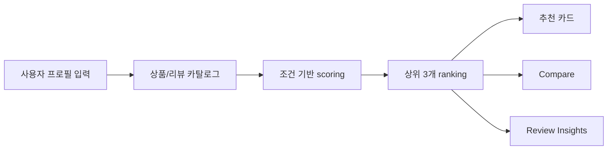
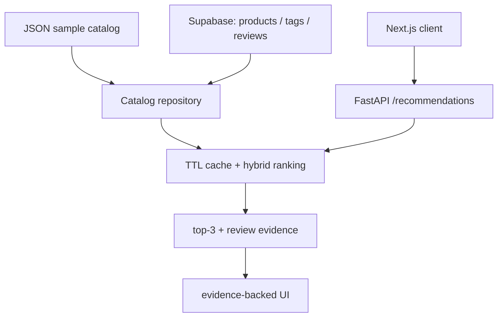

# GlowFit AI

[](https://github.com/Samuel-0930/glowfit-ai/actions/workflows/ci.yml)

**피부 프로필을 입력하면 리뷰 근거와 함께 상위 제품을 동적으로 추천하는 뷰티 추천 시스템**

GlowFit AI는 화장품 리뷰와 상품 속성 데이터를 기반으로 사용자의 피부 타입, 고민, 선호 제형, 향 민감도, 예산, 회피 조건을 반영해 제품을 랭킹합니다. 단순히 정해진 결과를 보여주는 데모가 아니라, 입력 조건이 바뀌면 추천 후보와 점수, 리뷰 근거, 비교 화면이 함께 바뀌도록 구성했습니다.

[Notion 포트폴리오 보기](https://app.notion.com/p/3996f7e3d828811fa0d7e358a783d6f6)

## 현재 데모에서 볼 수 있는 것

| 화면 | 역할 |
| --- | --- |
| 추천 | 사용자가 피부 조건을 직접 선택하고 상위 3개 제품을 추천받습니다. |
| 비교 | fit·confidence 원형 점수, 근거·주의 항목, 모델별 랭킹 신호를 비교합니다. |
| 리뷰 분석 | 추천에 사용된 리뷰 snippet과 aspect coverage를 확인합니다. |
| 실험 | 커밋된 샘플 카탈로그를 기준으로 재생성한 오프라인 평가 결과를 확인합니다. |

## 제품 흐름



## 핵심 구현

| 영역 | 구현 내용 |
| --- | --- |
| 입력 자유도 | 피부 타입, concerns, texture, fragrance sensitivity, budget, avoid 조건을 직접 선택 |
| 동적 랭킹 | FastAPI가 입력 profile과 상품 tag, 리뷰 evidence, 예산 조건을 조합해 score 계산 |
| 설명 가능성 | 추천 결과마다 reasons, cautions, evidence snippet, model signal을 함께 표시 |
| 비교 UX | fit/confidence를 원형 score로 보여주고, model signal은 동적 bar로 비교 |
| 한국어 정보 구조 | 탐색, 입력, 안내 문구는 한국어로 제공하고 카탈로그 원문과 리뷰 근거는 보존 |
| 검증 | Next build, Vitest, Python test suite, ranking evaluation script |

## 데모 화면

| 추천 변화 | 후보 비교 | 리뷰 분석 |
| --- | --- | --- |
|  |  |  |

## 왜 이 프로젝트가 포트폴리오로 강한가

- **추천 시스템 문제를 제품 흐름으로 연결했습니다.** 입력 profile, ranking score, 추천 결과, 리뷰 근거, 비교 화면이 하나의 사용자 여정으로 이어집니다.
- **정답 고정 데모를 피했습니다.** 조건을 바꾸면 추천 후보와 점수도 바뀌는 구조라 모델/랭킹 로직이 화면에서 드러납니다.
- **설명 가능한 추천을 구현했습니다.** 단순 점수 대신 review evidence와 aspect tag를 함께 보여줍니다.
- **데이터 파이프라인과 평가를 갖췄습니다.** 공개 데이터 preview, ASIN join, offline ranking evaluation을 별도 script와 문서로 관리합니다.

## 모델/랭킹 구조

프론트엔드는 FastAPI의 `/recommendations`를 호출합니다. API는 기본 JSON 카탈로그 또는
Supabase 카탈로그를 선택해 로드하고, 원격 카탈로그는 짧은 TTL 캐시로 재사용합니다.
Supabase에 연결할 수 없으면 추천을 mock 결과로 대체하지 않고 `503` 오류를 반환합니다.



| Signal | 현재 구현 |
| --- | --- |
| popularity | 상품의 `review_count`를 정규화한 베이스라인 |
| rating | 상품의 `average_rating`을 정규화한 베이스라인 |
| collaborative | 사용자-아이템 행렬 학습이 아닌, 관측 리뷰 평점 평균 베이스라인 |
| content | 프로필-상품 tag 겹침에 예산 보너스와 회피 조건 패널티를 더한 점수 |
| two_tower | 학습된 two-tower가 아닌 해시 기반 텍스트 벡터 코사인 유사도 베이스라인 |
| fit score | content 0.40, two_tower 0.30, collaborative 0.15, popularity 0.10, 리뷰 근거 보너스를 합친 최종 순위 점수 |

## 실행 방법

Python 의존성 설치:

```bash
python3 -m pip install -e ".[dev]"
```

API 실행:

```bash
python3 -m uvicorn api.main:app --reload --port 8000
```

Supabase 카탈로그를 사용하려면 `.env.example`을 참고해 `GLOWFIT_CATALOG_SOURCE=supabase`,
`SUPABASE_URL`, `SUPABASE_SECRET_KEY`를 API 서버 환경에만 설정합니다. 연결 전 확인 방법과
로컬/호스팅 프로젝트별 설정은 [Supabase 문서](docs/supabase.md)를 참고하세요.

추천 API 호출:

```bash
curl -X POST http://localhost:8000/recommendations \
  -H "Content-Type: application/json" \
  -d '{
    "preferences": {
      "skin_type": "dry",
      "concerns": ["redness", "barrier care"],
      "texture": "light",
      "fragrance_sensitivity": "high",
      "budget_max_usd": 25,
      "avoid": ["strong scent", "sticky finish"]
    },
    "limit": 3
  }'
```

Frontend 실행:

```bash
npm --prefix frontend install
npm --prefix frontend run dev
```

브라우저에서 `http://localhost:3000`을 엽니다.

## 데이터와 평가 파이프라인

Amazon Beauty 스타일 JSONL을 GlowFit artifact로 변환:

```bash
python3 scripts/ingest_amazon_beauty_jsonl.py \
  --metadata sample_data/raw_amazon_metadata.jsonl \
  --reviews sample_data/raw_amazon_reviews.jsonl \
  --output-dir data/processed/amazon_beauty_sample
```

Hugging Face 공개 데이터 preview:

```bash
python3 scripts/fetch_huggingface_preview.py --length 25
```

ASIN 기준으로 상품과 리뷰가 매칭된 public mini dataset 생성:

```bash
python3 scripts/fetch_huggingface_joined_preview.py \
  --target-matches 25 \
  --max-review-rows 250
```

processed public artifact 평가:

```bash
python3 scripts/evaluate_public_artifacts.py \
  --artifact-dir data/processed/hf_joined_preview \
  --output artifacts/public_evaluation.json
```

## 검증

```bash
python3 -m ruff check .
python3 -m pytest -q
npm --prefix frontend test
npm --prefix frontend run build
```

최근 확인:

| Check | Result |
| --- | --- |
| Frontend build | passed |
| Frontend tests | 4 passed |
| Python tests | 40 passed |

## 배포

개인 포트폴리오 데모는 Vercel Hobby에서 프론트엔드와 FastAPI를 별도 프로젝트로 배포할 수 있습니다.
API는 Vercel Python Runtime의 `api/index.py` 진입점을 사용하며, 요청 제한은 서버 메모리가 아닌
Vercel Firewall에서 적용합니다. 환경 변수와 Firewall 규칙은 [배포 체크리스트](docs/deployment.md)를
따릅니다.

## 문서

- Architecture: [docs/architecture.md](docs/architecture.md)
- Data ingestion: [docs/data-ingestion.md](docs/data-ingestion.md)
- Hugging Face preview: [docs/huggingface-preview.md](docs/huggingface-preview.md)
- Joined public preview: [docs/huggingface-joined-preview.md](docs/huggingface-joined-preview.md)
- Evaluation: [docs/evaluation.md](docs/evaluation.md)
- Portfolio case study: [docs/portfolio-case-study.md](docs/portfolio-case-study.md)
- Supabase catalog: [docs/supabase.md](docs/supabase.md)
- Deployment checklist: [docs/deployment.md](docs/deployment.md)
- Security test plan: [docs/security-test-plan.md](docs/security-test-plan.md)
