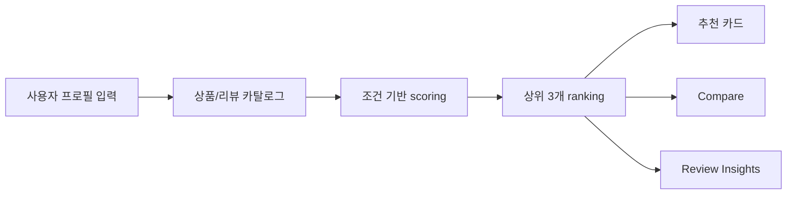
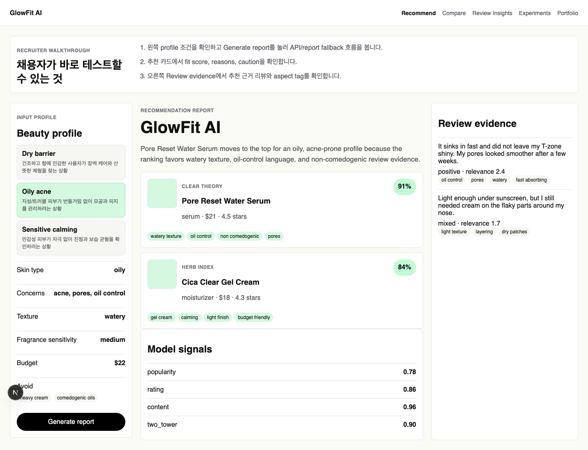
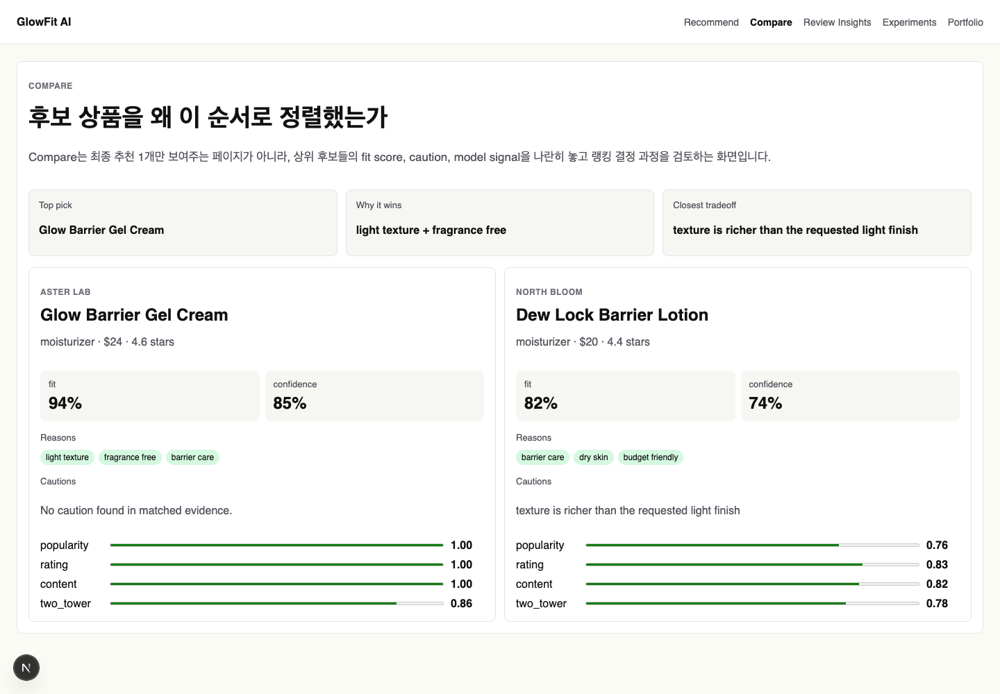
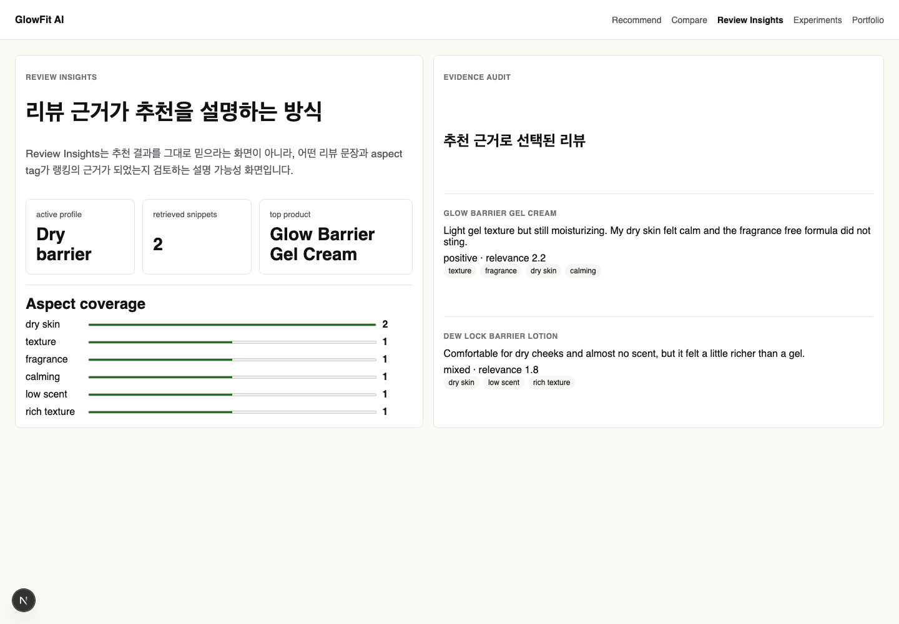
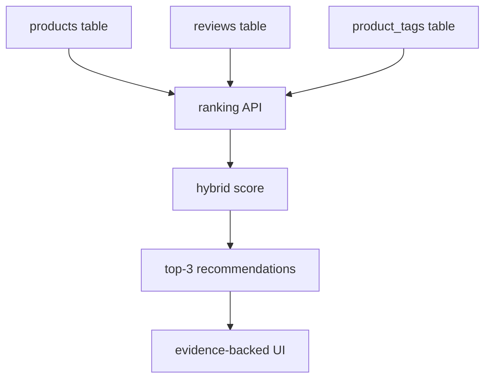

# GlowFit AI

[](https://github.com/Samuel-0930/glowfit-ai/actions/workflows/ci.yml)

**피부 프로필을 입력하면 리뷰 근거와 함께 상위 제품을 동적으로 추천하는 뷰티 추천 시스템**

GlowFit AI는 화장품 리뷰와 상품 속성 데이터를 기반으로 사용자의 피부 타입, 고민, 선호 제형, 향 민감도, 예산, 회피 조건을 반영해 제품을 랭킹합니다. 단순히 정해진 결과를 보여주는 데모가 아니라, 입력 조건이 바뀌면 추천 후보와 점수, 리뷰 근거, 비교 화면이 함께 바뀌도록 구성했습니다.

[Notion 포트폴리오 보기](https://app.notion.com/p/3746f7e3d82881919c76e7340a8a508a)

## 현재 데모에서 볼 수 있는 것

| 화면 | 역할 |
| --- | --- |
| 추천 | 사용자가 피부 조건을 직접 선택하고 상위 3개 제품을 추천받습니다. |
| 비교 | fit score, confidence, budget, review, hybrid signal을 원형 점수와 bar로 비교합니다. |
| 리뷰 분석 | 추천에 사용된 리뷰 snippet과 aspect coverage를 확인합니다. |
| 실험 | public artifact evaluation 결과와 ranking metric을 확인합니다. |

## 제품 흐름



## 핵심 구현

| 영역 | 구현 내용 |
| --- | --- |
| 입력 자유도 | 피부 타입, concerns, texture, fragrance sensitivity, budget, avoid 조건을 직접 선택 |
| 동적 랭킹 | `inferRecommendations()`가 입력 profile과 상품 match tag, 리뷰 evidence, 예산 조건을 조합해 score 계산 |
| 설명 가능성 | 추천 결과마다 reasons, cautions, evidence snippet, model signal을 함께 표시 |
| 비교 UX | fit/confidence를 원형 score로 보여주고, model signal은 동적 bar로 비교 |
| 한글 제품 경험 | 채용자 설명을 노골적으로 전면에 두기보다 실제 사용자용 제품 화면처럼 구성 |
| 검증 | Next build, Vitest, Python test suite, ranking evaluation script |

## 데모 화면

| 추천 변화 | 후보 비교 | 리뷰 분석 |
| --- | --- | --- |
|  |  |  |

## 왜 이 프로젝트가 포트폴리오로 강한가

- **추천 시스템 문제를 제품 흐름으로 연결했습니다.** 입력 profile, ranking score, 추천 결과, 리뷰 근거, 비교 화면이 하나의 사용자 여정으로 이어집니다.
- **정답 고정 데모를 피했습니다.** 조건을 바꾸면 추천 후보와 점수도 바뀌는 구조라 모델/랭킹 로직이 화면에서 드러납니다.
- **설명 가능한 추천을 구현했습니다.** 단순 점수 대신 review evidence와 aspect tag를 함께 보여줍니다.
- **데이터 파이프라인과 평가를 갖췄습니다.** 공개 데이터 preview, ASIN join, offline ranking evaluation을 별도 script와 문서로 관리합니다.

## 모델/랭킹 구조

현재 프론트엔드 데모는 client-side inference로 동작합니다. Supabase 같은 DB를 붙이면 아래 구조로 자연스럽게 확장할 수 있습니다.



| Signal | 의미 |
| --- | --- |
| profile | 피부 타입, 고민, 제형 조건과 상품 tag의 일치도 |
| review | 선택된 리뷰 evidence의 relevance |
| budget | 예산 조건 충족 여부 |
| hybrid | profile, review, rating, review count, budget penalty를 합친 최종 score |

## 실행 방법

Python 의존성 설치:

```bash
python -m pip install -e ".[dev]"
```

API 실행:

```bash
uvicorn api.main:app --reload --port 8000
```

Frontend 실행:

```bash
npm --prefix frontend install
npm --prefix frontend run dev
```

브라우저에서 `http://localhost:3000`을 엽니다.

## 데이터와 평가 파이프라인

Amazon Beauty 스타일 JSONL을 GlowFit artifact로 변환:

```bash
python scripts/ingest_amazon_beauty_jsonl.py \
  --metadata sample_data/raw_amazon_metadata.jsonl \
  --reviews sample_data/raw_amazon_reviews.jsonl \
  --output-dir data/processed/amazon_beauty_sample
```

Hugging Face 공개 데이터 preview:

```bash
python scripts/fetch_huggingface_preview.py --length 25
```

ASIN 기준으로 상품과 리뷰가 매칭된 public mini dataset 생성:

```bash
python scripts/fetch_huggingface_joined_preview.py \
  --target-matches 25 \
  --max-review-rows 250
```

processed public artifact 평가:

```bash
python scripts/evaluate_public_artifacts.py \
  --artifact-dir data/processed/hf_joined_preview \
  --output artifacts/public_evaluation.json
```

## 검증

```bash
uv run ruff check .
uv run pytest -q
npm --prefix frontend test
npm --prefix frontend run build
```

최근 확인:

| Check | Result |
| --- | --- |
| Frontend build | passed |
| Frontend tests | 3 passed |
| Python tests | 31 passed |

## 문서

- Architecture: [docs/architecture.md](docs/architecture.md)
- Data ingestion: [docs/data-ingestion.md](docs/data-ingestion.md)
- Hugging Face preview: [docs/huggingface-preview.md](docs/huggingface-preview.md)
- Joined public preview: [docs/huggingface-joined-preview.md](docs/huggingface-joined-preview.md)
- Evaluation: [docs/evaluation.md](docs/evaluation.md)
- Portfolio case study: [docs/portfolio-case-study.md](docs/portfolio-case-study.md)
