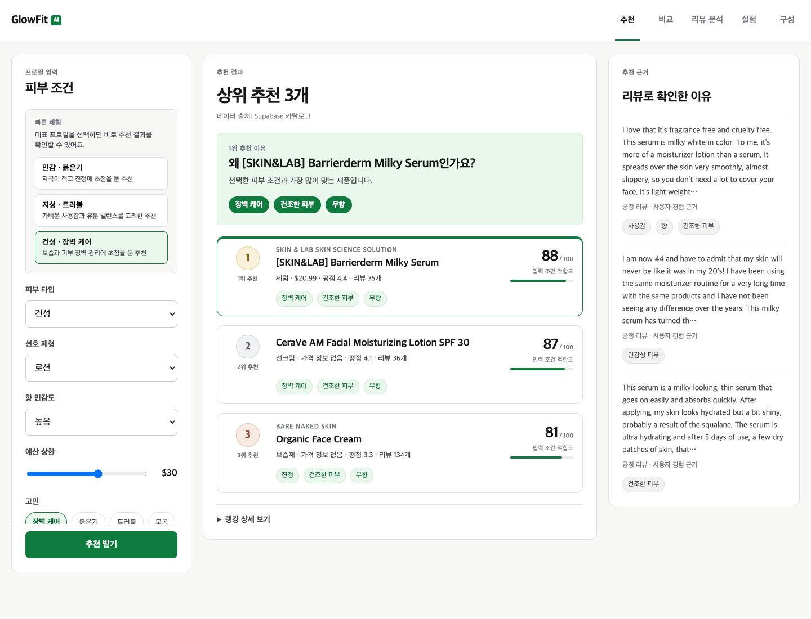
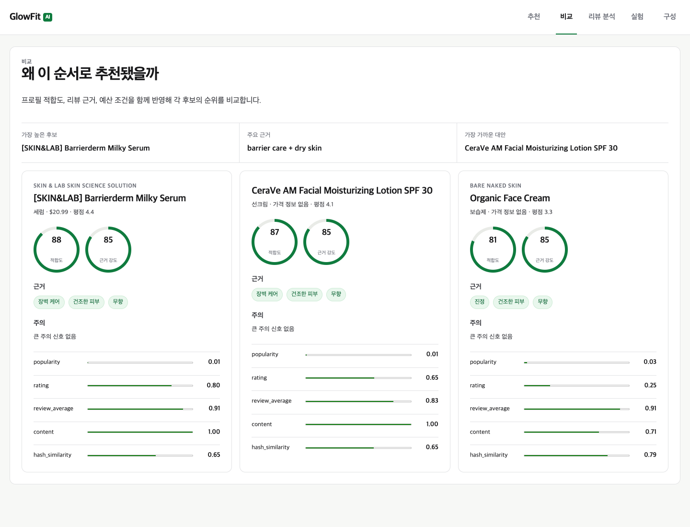
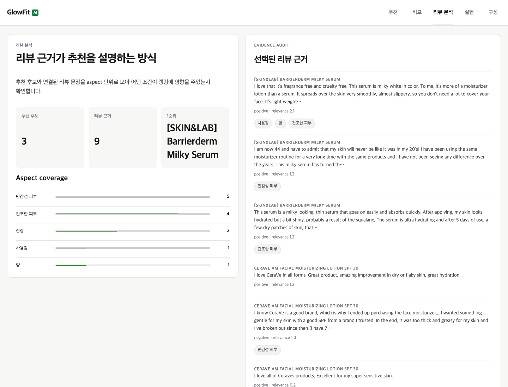
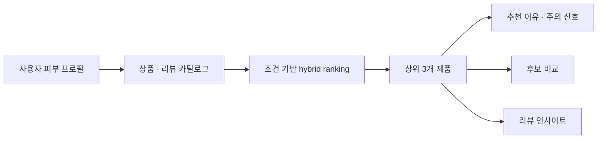
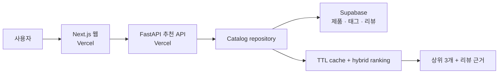

# GlowFit AI

> **피부 프로필에 맞는 제품을 추천하고, 점수 뒤의 리뷰 근거와 주의 신호까지 함께 보여주는 설명 가능한 뷰티 추천 시스템**

[](https://github.com/Samuel-0930/glowfit-ai/actions/workflows/ci.yml)
[](https://glowfit-web.vercel.app)

[데모 열기](https://glowfit-web.vercel.app) · [API Health](https://glowfit-api.vercel.app/health) · [포트폴리오 문서](https://app.notion.com/p/3996f7e3d828811fa0d7e358a783d6f6)


## 왜 만들었나

뷰티 제품 추천은 평점만 높다고 개인에게 잘 맞는다고 말하기 어렵습니다. 피부 타입, 고민, 제형 선호, 향 민감도, 예산, 회피 조건에 따라 같은 제품도 전혀 다른 선택이 될 수 있기 때문입니다.

GlowFit AI는 사용자의 프로필을 입력으로 받아 상품 속성·리뷰·예산 조건을 결합해 순위를 계산합니다. 그리고 단순 적합도 점수에서 멈추지 않고 **추천 이유, 주의할 점, 관련 리뷰 snippet**을 같이 제공합니다.

| 운영 카탈로그 | 사용자 입력 | 결과 | 핵심 원칙 |
| --- | --- | --- | --- |
| 100개 페이스 스킨케어 제품 · 1,074개 리뷰 | 피부 타입·고민·제형·향 민감도·예산·회피 조건 | 상위 3개 제품과 근거 기반 비교 | 점수보다 “왜 추천됐는가”를 설명 |

## 데모에서 확인할 수 있는 것

1. **프로필 기반 추천** — 조건이 바뀌면 후보·적합도·추천 근거가 함께 바뀝니다.
2. **후보 비교** — 적합도, 근거 강도, 장점, 주의 항목, 랭킹 신호를 같은 기준에서 비교합니다.
3. **리뷰 인사이트** — 추천에 활용된 리뷰 snippet과 aspect coverage를 확인합니다.
4. **안전한 실패 처리** — 원격 카탈로그를 불러올 수 없으면 가짜 추천으로 대체하지 않고 API 오류를 반환합니다.

| 추천 | 후보 비교 | 리뷰 인사이트 |
| --- | --- | --- |
|  |  |  |

## 추천 흐름



| 단계 | 구현 |
| --- | --- |
| 입력 | skin type, concerns, texture, fragrance sensitivity, budget, avoid 조건을 직접 선택 |
| 랭킹 | 상품 태그·리뷰 신호·예산·회피 조건을 결합한 hybrid score |
| 설명 | reasons, cautions, evidence snippet, model signal을 추천 카드에 연결 |
| 비교 | 적합도와 근거 강도, 각 랭킹 신호를 후보 간 동일한 기준으로 표시 |
| 운영 | API 기반 동적 추천, TTL cache와 stale fallback, CI·배포 smoke check |

## 점수와 근거의 해석

| 신호 | 역할 |
| --- | --- |
| popularity | `review_count`를 정규화한 baseline |
| rating | `average_rating`을 정규화한 baseline |
| review average | 관측 리뷰 평점 평균 baseline |
| content | 프로필-상품 태그 겹침 + 예산 보너스 - 회피 조건 패널티 |
| hash similarity | 해시 기반 텍스트 벡터의 코사인 유사도 baseline |
| fit score | content 0.40, hash similarity 0.30, review average 0.15, popularity 0.10, 리뷰 근거 보너스를 결합한 최종 정렬 신호 |

`fit score`와 `근거 강도`는 후보를 **정렬하고 설명하기 위한 상대 신호**입니다. 모델 정확도나 일반화 성능을 뜻하지 않으며, 값이 `1.0`이어도 해당 입력 안에서 정규화된 랭킹 값일 뿐 성능 100%를 의미하지 않습니다.

## 시스템 구성



| 구성 | 역할 |
| --- | --- |
| [Next.js 웹](https://glowfit-web.vercel.app) | 프로필 입력, 추천·비교·리뷰 인사이트 인터페이스 |
| [FastAPI](https://glowfit-api.vercel.app/health) | 프로필 기반 ranking과 근거 생성 API |
| Supabase | 운영 데모용 제품·태그·리뷰 카탈로그 |
| GitHub Actions | Python·프론트엔드 검증과 공개 URL smoke check |

## 빠른 실행

필수 조건: Python 3.11+, Node.js 20+

```bash
git clone https://github.com/Samuel-0930/glowfit-ai.git
cd glowfit-ai

python3 -m pip install -e ".[dev]"
npm --prefix frontend install
```

터미널 두 개에서 실행합니다.

```bash
# terminal 1 — API: http://localhost:8000/docs
python3 -m uvicorn api.main:app --reload --port 8000
```

```bash
# terminal 2 — web: http://localhost:3000
npm --prefix frontend run dev
```

Supabase 카탈로그를 사용하려면 `.env.example`을 참고해 API 환경에 `GLOWFIT_CATALOG_SOURCE=supabase`, `SUPABASE_URL`, `SUPABASE_SECRET_KEY`를 설정합니다. 상세 절차는 [Supabase 문서](docs/supabase.md)를 참고하세요.

## 검증

```bash
python3 -m ruff check .
python3 -m pytest -q
npm --prefix frontend test
npm --prefix frontend run build
```

## 데이터와 평가의 해석 한계

| 구분 | 범위 |
| --- | --- |
| 운영 데모 | Supabase에 적재된 100개 제품·1,074개 리뷰로 동적 추천과 근거 UI를 검증 |
| 개발 fixture | 결정론적 소규모 fixture로 API·UI·파이프라인을 재현 |
| 공개 평가 파이프라인 | Amazon Beauty 스타일 데이터에서 ASIN join, precision@k·recall@k·NDCG@k를 계산 |

- 커밋된 3개 제품 fixture는 모든 제품이 relevance 기준을 충족해 모델 비교용 benchmark가 아닙니다. 평가 결과는 `comparative_ready: false`로 명시합니다.
- 현재 시스템은 학습된 Two-Tower 모델이나 실사용자 전환율 개선을 주장하지 않습니다. 태그·리뷰 기반 baseline과 설명 가능한 추천 경험을 검증하는 프로젝트입니다.
- 더 큰 비퇴화 ASIN-joined 데이터와 시간 순서 holdout이 있어야 랭킹 품질을 비교할 수 있습니다.
- 원격 카탈로그가 없는 경우 mock 추천을 반환하지 않고 오류를 드러내는 것이 의도된 동작입니다.

## 기술 스택

**Recommendation & Data**: Python, Pandas, NumPy, scikit-learn, Pydantic

**API & UI**: FastAPI, Next.js, TypeScript, Tailwind CSS

**Platform**: Supabase, Vercel, GitHub Actions

## 문서

- [포트폴리오 사례 문서](docs/portfolio-case-study.md)
- [아키텍처](docs/architecture.md)
- [평가 기준과 무결성 게이트](docs/evaluation.md)
- [데이터 수집 파이프라인](docs/data-ingestion.md)
- [Hugging Face joined preview](docs/huggingface-joined-preview.md)
- [Supabase 카탈로그 설정](docs/supabase.md)
- [배포 체크리스트](docs/deployment.md)
- [보안 테스트 계획](docs/security-test-plan.md)
