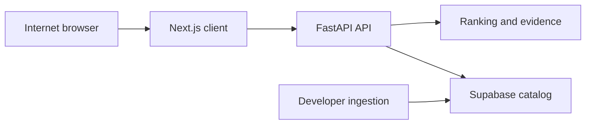

# GlowFit AI Threat Model

## Executive summary

GlowFit AI is currently a portfolio recommendation demo: a Next.js browser client sends a skin-preference profile to a FastAPI API, which ranks a catalog from local JSON or (optionally) Supabase and returns product data plus review evidence. The highest near-term risks are anonymous resource abuse of a public API and accidental disclosure of personal information embedded in future review text. The Supabase server credential is intentionally kept off the client but is a high-value trust boundary because it reads user-linked reviews.

## Scope and assumptions

- **In scope:** `frontend/`, `api/`, `src/glowfit/`, `supabase/`, ingestion scripts, and `.github/workflows/ci.yml`.
- **Out of scope:** actual hosting/CDN/WAF configuration, Supabase project settings, deployment secrets, and any third-party dataset/provider controls; these were not present in the repository.
- **Confirmed context:** this is a portfolio deployment today; future real-user reviews are planned; FastAPI is the only intended Supabase client and holds the server key.
- **Assumptions:** the portfolio is reachable on the public internet; user identity is not yet authenticated; the future review text may contain personal information; no upstream rate limit or security headers are assumed unless verified in deployment configuration.
- **Open questions:** intended retention/deletion policy for reviews; hosting platform's actual rate/body limits; whether future users will have accounts and edit/delete their reviews.

## System model

### Primary components

- **Next.js client:** Collects preference inputs and posts them to the configured public API (`frontend/lib/api.ts:3-15`).
- **FastAPI API:** Exposes health, products, recommendation, report, and compare routes (`api/main.py:87-170`), uses Pydantic models, and applies a CORS origin list (`api/main.py:50-61`).
- **Catalog/ranking service:** Reads JSON fixtures or three Supabase tables, runs ranking and evidence retrieval (`src/glowfit/catalog.py:58-140`; `src/glowfit/evidence.py:17-43`).
- **Supabase catalog:** Holds products, tags, and reviews; RLS is enabled, with service-role read grants (`supabase/migrations/20260710234242_create_glowfit_catalog.sql:1-36`).
- **Data/CI tooling:** Controlled developer scripts ingest public data; GitHub Actions builds and tests the app (`.github/workflows/ci.yml:1-45`).

### Data flows and trust boundaries

- **Internet browser → Next.js client:** Static application assets and preference UI. Browser-side configuration contains only `NEXT_PUBLIC_API_BASE_URL`; it must never contain secrets.
- **Browser → FastAPI:** JSON preference profile and comparison IDs over HTTPS in production. CORS accepts configured origins and does not use cookies (`api/main.py:51-61`); there is no authentication, authorization, or rate limit visible in code.
- **FastAPI → catalog/ranking:** Parsed Pydantic request data drives in-process ranking and evidence search. `RecommendationRequest.limit` is constrained to 1–10 (`api/main.py:26-29`), but nested preference data has no size constraints (`src/glowfit/schemas.py:26-32`).
- **FastAPI → Supabase:** HTTP REST reads of product, tag, and review fields using a server-only secret/service-role key (`src/glowfit/catalog.py:75-96, 133-140`). This boundary crosses product data, review text, dates, and user IDs.
- **Developer → ingestion artifacts:** Public JSONL/Hugging Face data is parsed by local scripts and written under ignored data directories; this is not a request-facing runtime path.

#### Diagram

## Assets and security objectives

| Asset | Why it matters | Security objective (C/I/A) |
|---|---|---|
| Future review text and linked user identifiers | May contain direct or contextual personal information | C, I |
| Supabase secret/service credential | Permits server-side catalog access and can bypass normal user-facing access controls | C, I |
| Catalog and recommendation evidence | Integrity affects user trust and the portfolio's credibility | I, A |
| API capacity and Supabase read budget | Public unauthenticated requests can consume limited resources | A |
| Source/build artifacts | Compromise changes what is deployed or published | I |

## Attacker model

### Capabilities

- An unauthenticated internet user can call the documented API routes directly, bypassing the UI.
- A user can submit arbitrary JSON values to public request models and repeat requests at scale.
- A future review author can submit free text that may include personal data or adversarial/low-quality content.
- An attacker who obtains a deployment secret or can alter deployment configuration may use the server-side catalog credential.

### Non-capabilities

- No evidence shows direct browser access to Supabase or a Supabase key shipped to the frontend.
- No user upload, shell execution, dynamic code evaluation, SQL construction, or server-side URL input is exposed in the reviewed runtime routes.
- No write API or authentication workflow exists in the current repository.

## Entry points and attack surfaces

| Surface | How reached | Trust boundary | Notes | Evidence |
|---|---|---|---|---|
| `GET /products` | Direct public HTTP request | Internet → API | Returns full product catalog | `api/main.py:98-100` |
| `POST /recommendations` | Frontend or direct HTTP JSON request | Internet → API → ranking | Accepts nested preference arrays/strings; returns evidence | `api/main.py:128-149` |
| `POST /recommend`, `/report`, `/compare` | Direct public HTTP request | Internet → API | Parallel public API surfaces; compare list is unbounded | `api/main.py:103-113, 152-170` |
| Supabase REST reads | FastAPI process using environment credential | API → Supabase | Reads review `user_id`, text, and date | `src/glowfit/catalog.py:75-123` |
| Public-data ingestion | Developer-run local commands | External data → artifacts | Inputs are not runtime request data, but influence catalog/model integrity | `docs/architecture.md:3-10` |

## Top abuse paths

1. **API capacity exhaustion:** attacker sends high-rate or oversized recommendation requests → FastAPI repeatedly loads/ranks catalog → API/Supabase capacity is consumed → portfolio becomes unavailable.
2. **Catalog enumeration:** attacker calls `GET /products` and recommendation endpoints repeatedly → reconstructs the catalog and public evidence → enables scraping or unwanted redistribution.
3. **Future review privacy disclosure:** user includes contact/order/health details in a review → ranking selects that review → raw `EvidenceSnippet.text` is returned to anonymous visitors → personal content is disclosed.
4. **Credential/boundary compromise:** deployment secret leaks or server configuration is altered → attacker uses the Supabase credential → reads all user-linked review records, including fields not needed by the public response.
5. **Data integrity degradation:** attacker or uncontrolled source contributes bad/poisoned reviews → ingestion loads them into catalog → evidence/recommendations become misleading or unsafe.
6. **Deployment hardening gap:** service is started with development settings or without host/header controls → operational metadata and defensive gaps are exposed → exploitability of other issues rises.

## Threat model table

| Threat ID | Threat source | Prerequisites | Threat action | Impact | Impacted assets | Existing controls (evidence) | Gaps | Recommended mitigations | Detection ideas | Likelihood | Impact severity | Priority |
|---|---|---|---|---|---|---|---|---|---|---|---|---|
| TM-001 | Anonymous internet client | Public API URL | Floods recommendation/report/compare routes or sends large nested JSON | API or Supabase read exhaustion | API capacity, catalog availability | Request `limit` is 1–10 (`api/main.py:26-29`); cache exists (`src/glowfit/catalog.py:33-55`) | No visible rate/body/concurrency limit; preference lists and strings unbounded | Enforce edge per-IP rate and body caps; constrain schema list/string sizes; cap compare IDs | 429/5xx rate, latency, request-size and source-IP metrics | High | Medium | high |
| TM-002 | Anonymous internet client | Public API deployment | Scrapes `/products` and recommendation responses | Catalog/evidence redistribution and cost | Catalog confidentiality, availability | CORS origin list (`api/main.py:51-61`) | CORS does not stop non-browser callers; no pagination/quotas | Decide public-data policy; paginate or remove full catalog route; apply quotas/cache | Route volume, unusual sequential requests, egress anomalies | Medium | Low | medium |
| TM-003 | Future reviewer or anonymous visitor | Real reviews are stored and selected as evidence | Inserts/causes selection of PII in raw review text, then retrieves it via recommendation response | Privacy disclosure | Review text and user privacy | Response omits `user_id` in `EvidenceSnippet` (`src/glowfit/schemas.py:35-43`) | Raw text is copied verbatim (`src/glowfit/evidence.py:34-43`); no moderation/retention policy shown | Redact/moderate text, serve approved excerpts only, define consent/deletion/access policy | PII scan findings, redaction counts, DSAR/deletion audit log | Medium | High | high (when real reviews exist) |
| TM-004 | Attacker with deployment/config access | Obtains Supabase server credential or controls target URL | Uses credential to read broad catalog/review records | Bulk exposure of user-linked data | Supabase credential, reviews | `.env` ignored; docs prohibit frontend exposure (`.gitignore:2-4`, `.env.example:6-13`) | API reads `user_id` with secret/service role; broad service-role access | Managed secret store, rotation, least-privilege view/RPC omitting user ID, strict HTTPS endpoint validation | Secret-manager access audit, Supabase logs, unusual bulk reads | Low | High | medium |
| TM-005 | Malicious or low-quality data supplier | Data ingestion is run with unreviewed source records | Poison reviews/metadata or introduce personal data into artifacts | Recommendation integrity/privacy degradation | Catalog integrity, review privacy | Developer-controlled scripts; ignored processed data (`.gitignore:24-29`) | No visible source approval, validation, PII filtering, provenance record | Pin/approve sources, validate schema/content, PII filter, retain provenance and reproducible hashes | Ingestion validation failures, distribution drift, artifact checksums | Medium | Medium | medium |
| TM-006 | External attacker exploiting deployment gaps | Public deployment lacks equivalent edge protections | Uses public docs/host/header/browser-defense gaps to aid abuse or clickjacking | Increased discovery and exploitability | API, browser users | Strict CORS without credentials (`api/main.py:51-61`) | Default FastAPI docs; no visible trusted-host or frontend security headers; local docs use reload | Production config disables/protects docs, trusted hosts, CSP/frame-ancestors/nosniff/referrer policy, no reload | Deployment config review, header test, exposed-docs scan | Medium | Low | medium |

## Criticality calibration

- **Critical:** direct unauthenticated bulk exfiltration of real user reviews/credentials, remote code execution, or a cross-tenant authorization bypass. No such flaw was found in the reviewed current runtime code.
- **High:** public API resource exhaustion (TM-001) and disclosure of personal review content once real reviews are introduced (TM-003).
- **Medium:** catalog scraping (TM-002), service credential blast radius (TM-004), supply-chain/data poisoning (TM-005), and missing production defense-in-depth (TM-006).
- **Low:** disclosure of non-sensitive demo metadata or issues requiring unlikely deployment misconfiguration with no user data.

## Focus paths for security review

| Path | Why it matters | Related Threat IDs |
|---|---|---|
| `api/main.py` | Public routes, CORS, API response surface, and production middleware | TM-001, TM-002, TM-006 |
| `src/glowfit/schemas.py` | Request-size and response data-minimization controls belong here | TM-001, TM-003 |
| `src/glowfit/evidence.py` | Direct raw review-text disclosure occurs here | TM-003 |
| `src/glowfit/catalog.py` | Service credential and Supabase read boundary | TM-004 |
| `supabase/migrations/20260710234242_create_glowfit_catalog.sql` | Review schema, RLS, and service-role grants | TM-003, TM-004 |
| `frontend/next.config.mjs` | Browser security headers and build/deployment posture | TM-006 |
| `scripts/` | External-data parsing and artifact provenance | TM-005 |
| `.github/workflows/ci.yml` | Dependency/build supply-chain controls | TM-005 |

## Quality check

- All discovered runtime entry points are covered: health, products, recommend, recommendations, report, compare, and the Supabase read path.
- Every trust boundary appears in at least one threat.
- Runtime paths are separated from developer ingestion and CI.
- User context was incorporated: portfolio now, real reviews later, server-only Supabase access.
- Hosting controls, retention policy, and actual production configuration remain explicit open questions.

